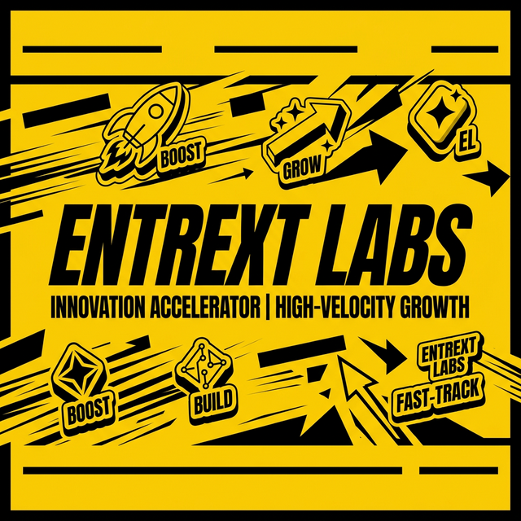

<div align="center">
  

  # ⚡ ENTREXT LABS
  **High-Velocity Micro-SaaS Studio & Venture Lab**

  [](https://nextjs.org/)
  [](https://react.dev/)
  [](https://tailwindcss.com/)
  [](LICENSE)

  [Live Site](https://entrextlabs.entrext.com) • [Product Gallery](https://entrextlabs.entrext.com/products) • [Venture Manifesto](https://entrextlabs.entrext.com/teams)
</div>

---

## 🚀 The Vision

Entrext Labs is not just a software company; it's a **High-Velocity Production Unit**. We ideate, build, and ship **5 functional micro-SaaS products every single week**. 

Our mission is to dominate diverse market niches—from HRTech and FinTech to AI Productivity and Gaming—by leveraging a "Scale or Kill" model: **7-day sprints, instant validation, and aggressive deployment.**

### 🛠 Key Features

- 🎡 **The Production Wheel**: Integrated monthly showcase of live, production-ready micro-SaaS tools.
- 🏗 **High-Output Engine**: Powered by a "Founding AI Engineer" model for rapid development.
- 🎯 **Niche Strategy**: Targeted deployment across high-leverage industries like PetTech, EdTech, and Creator Economy.
- 💎 **Premium Aesthetic**: A bold, high-contrast UI built with Tailwind CSS 4 and Framer Motion.
- 🤖 **AI-First Integration**: Native support for Gemini AI to power intelligent features across the ecosystem.

---

## 💻 Tech Stack

- **Framework**: [Next.js 15+](https://nextjs.org/) (App Router)
- **Library**: [React 19](https://react.dev/)
- **Styling**: [Tailwind CSS 4](https://tailwindcss.com/)
- **Animations**: [Motion](https://motion.dev/) (formerly Framer Motion)
- **Icons**: [Lucide React](https://lucide.dev/)
- **Database**: Better-SQLite3
- **AI**: Google Gemini AI (@google/genai)

---

## 🛠️ Getting Started

### Prerequisites

- **Node.js**: v18.17.0 or higher
- **npm**: v9.0.0 or higher

### Installation

1. **Clone the repository:**
   ```bash
   git clone https://github.com/entrext/entrext-labs.git
   cd entrext-labs
   ```

2. **Install dependencies:**
   ```bash
   npm install
   ```

3. **Environment Setup:**
   Create a `.env` file in the root directory and add your Gemini API Key:
   ```env
   GEMINI_API_KEY=your_gemini_api_key_here
   APP_URL=http://localhost:3000
   ```

4. **Run Development Server:**
   ```bash
   npm run dev
   ```
   Open [http://localhost:3000](http://localhost:3000) to see the lab in action.

---

## 📁 Project Structure

```text
src/
├── app/            # Next.js App Router (Layouts, Pages, Routes)
├── components/     # Reusable UI Components (Navbar, Footer, etc.)
├── views/          # Page-specific views and complex layouts
├── lib/            # Utility functions and shared logic
└── public/         # Static assets (Images, SVGs)
```

---

## 🏆 Shipped Highlights

Some of our recent weekly deployments:

| Product | Niche | Description |
| :--- | :--- | :--- |
| **Secretroom** | Social | Ephemeral anonymous chat service. Just vibes. |
| **ReTone** | AI Productivity | AI-powered text tone optimizer. |
| **PawNote** | PetTech | Vet instruction tracker for pet owners. |
| **PayShot** | FinTech | Screenshot-to-Invoice automation. |

---

## 🤝 Join the Lab

We are always looking for "Build in Public" developers and ambitious founding engineers. Check our [Manifesto](/teams) for open roles.

<div align="center">
  <p>Built with ⚡ by <b>Entrext Labs</b></p>
  <p><i>Ideate. Build. Ship. Repeat.</i></p>
</div>
